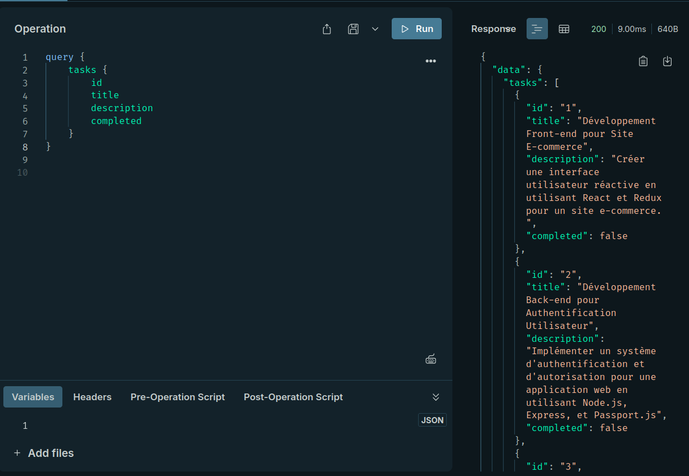
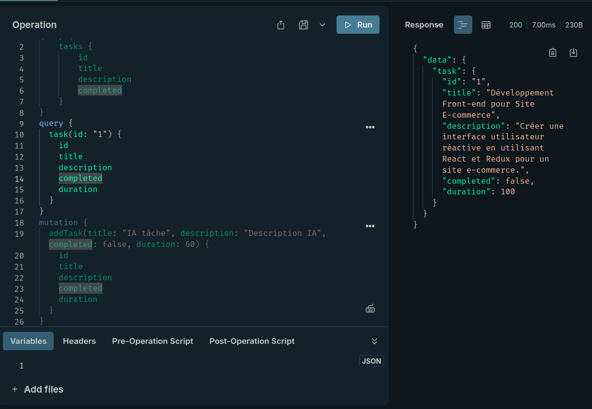
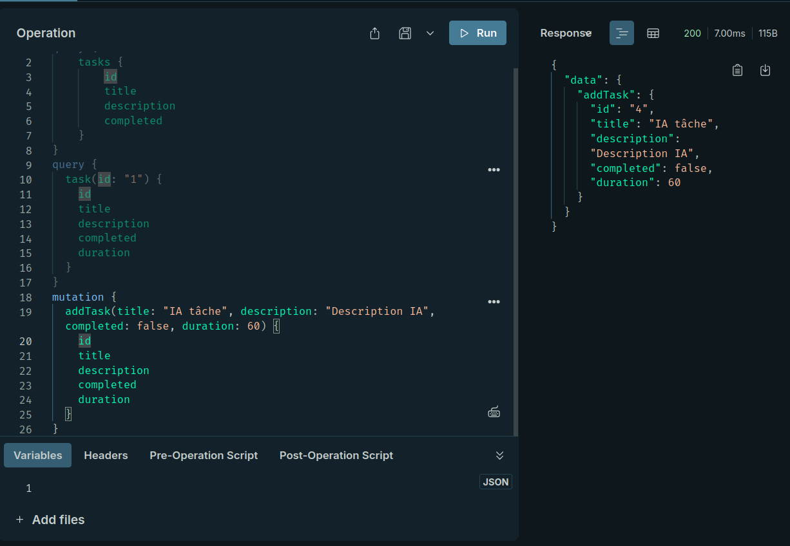
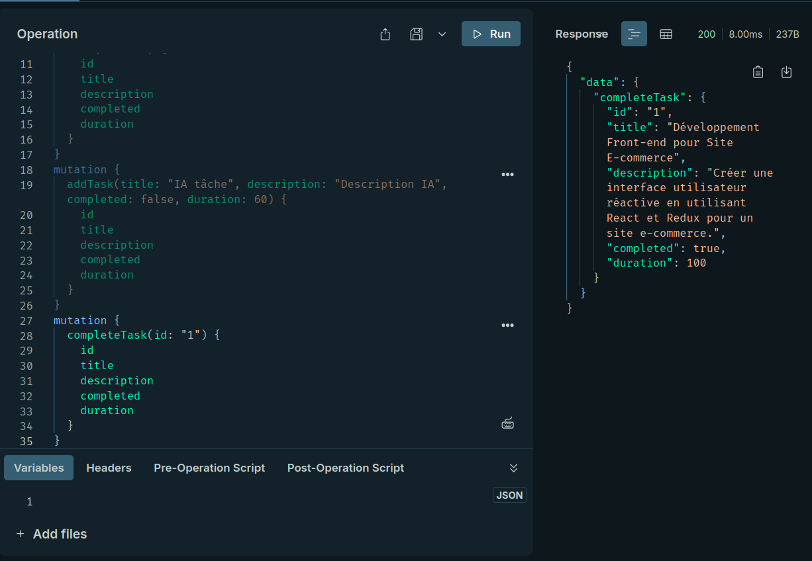
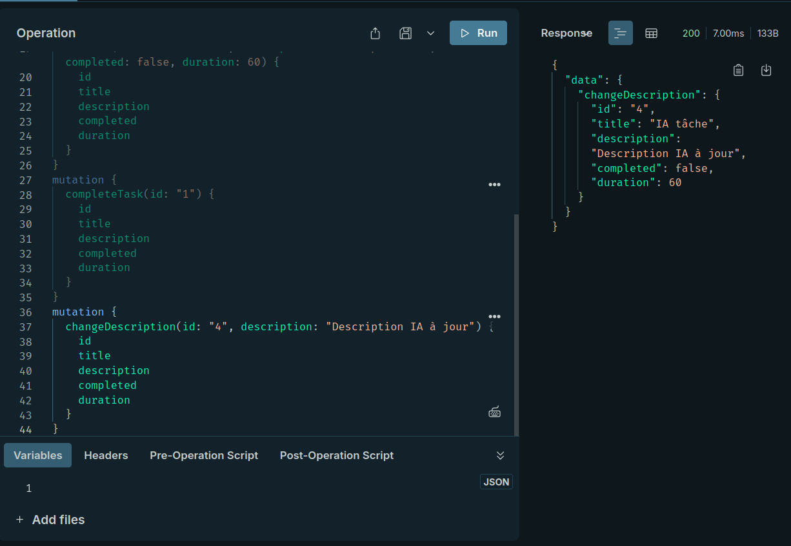
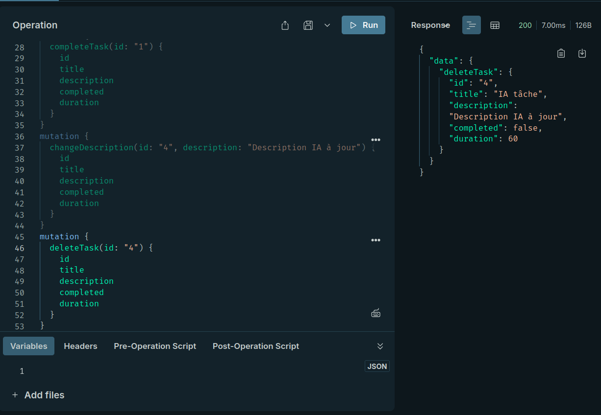

# TP3 - Création d'une API GraphQL avec Node.js et Apollo Server

Ce projet consiste à créer une API GraphQL en utilisant Node.js, Express, et Apollo Server. L'API permet de gérer une liste de tâches avec des opérations CRUD (Create, Read, Update, Delete) via des requêtes et des mutations GraphQL.

## Objectifs

- Comprendre comment configurer et utiliser GraphQL avec Node.js et Express.
- Apprendre à créer un schéma GraphQL et des résolveurs pour gérer les requêtes et les mutations.
- Tester les requêtes et mutations avec Apollo Sandbox.

## Technologies utilisées

- **Node.js** : Environnement d'exécution JavaScript.
- **Express** : Framework pour créer des APIs web.
- **Apollo Server** : Serveur GraphQL pour Node.js.
- **GraphQL** : Langage de requête pour les APIs.
- **Apollo Sandbox** : Interface graphique pour tester les requêtes GraphQL.

## Étapes du projet

### 1. Initialisation du projet

Nous avons commencé par créer un nouveau projet Node.js et installer les dépendances nécessaires, telles qu'Express, Apollo Server, et GraphQL. Ces outils nous permettent de configurer un serveur GraphQL et de gérer les requêtes et mutations.

### 2. Création du schéma GraphQL

Ensuite, nous avons défini un schéma GraphQL pour décrire les types de données et les opérations disponibles dans notre API. Le schéma inclut un type `Task` avec des champs comme `id`, `title`, `description`, `completed`, et `duration`. Nous avons également défini des requêtes pour récupérer des tâches et des mutations pour ajouter, mettre à jour, et supprimer des tâches.

### 3. Création des résolveurs

Après avoir défini le schéma, nous avons implémenté les résolveurs pour gérer les requêtes et les mutations. Les résolveurs sont des fonctions qui exécutent la logique métier, comme récupérer des tâches depuis une liste en mémoire, ajouter de nouvelles tâches, ou marquer une tâche comme terminée.

### 4. Configuration du serveur Apollo

Nous avons configuré un serveur Apollo avec Express pour servir notre API GraphQL. Le serveur Apollo utilise le schéma et les résolveurs que nous avons définis pour traiter les requêtes GraphQL entrantes.

### 5. Test de l'API avec Apollo Sandbox

Une fois le serveur configuré, nous avons démarré le serveur et utilisé Apollo Sandbox pour tester les requêtes et les mutations. Apollo Sandbox est une interface graphique qui permet d'exécuter des requêtes GraphQL et de visualiser les résultats.

## Exemples de requêtes et mutations

### Requête pour récupérer toutes les tâches

### Requête pour récupérer une tâche par son ID

### Mutation pour ajouter une nouvelle tâche

### Mutation pour marquer une tâche comme terminée

### Mutation pour changer la description d'une tâche

### Mutation pour supprimer une tâche

## Structure du projet

- `index.js` : Point d'entrée du serveur Apollo.
- `taskSchema.gql` : Schéma GraphQL pour les tâches.
- `taskResolver.js` : Résolveurs pour les requêtes et mutations.
- `taskSchema.js` : Importer et construire le schéma GraphQL.

---
