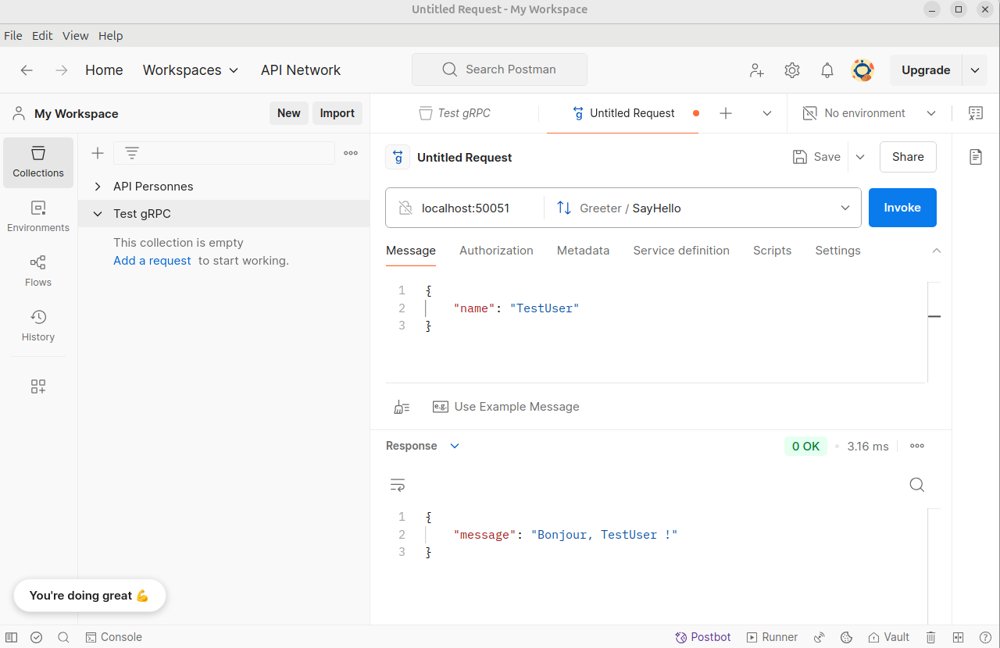

# TP4 - gRPC avec Node.js

Ce projet consiste à créer un service gRPC en utilisant Node.js. Le service permet de gérer des requêtes simples via gRPC et de tester ces requêtes avec Postman.

## Objectifs

- Comprendre les bases de gRPC.
- Implémenter un service gRPC simple en Node.js.
- Tester le service gRPC avec Postman.

## Technologies utilisées

- **Node.js** : Environnement d'exécution JavaScript.
- **gRPC** : Framework RPC pour des communications performantes.
- **Postman** : Outil pour tester les APIs.

## Étapes du projet

### 1. Initialisation du projet

Nous avons commencé par créer un nouveau projet Node.js et installer les dépendances nécessaires, telles que `@grpc/grpc-js` et `@grpc/proto-loader`. Ces outils nous permettent de configurer un serveur gRPC et de gérer les requêtes.

### 2. Création du fichier proto

Ensuite, nous avons défini un fichier `hello.proto` pour décrire le service gRPC et les messages échangés. Le fichier proto inclut une définition de service avec une méthode `SayHello` qui prend un message `HelloRequest` et retourne un message `HelloReply`.

### 3. Implémentation du serveur gRPC

Après avoir défini le fichier proto, nous avons implémenté le serveur gRPC en Node.js. Le serveur utilise le fichier proto pour gérer les requêtes entrantes et retourner des réponses appropriées.

### 4. Configuration du serveur

Nous avons configuré le serveur pour écouter sur un port spécifié dans un fichier `.env`. Le serveur utilise les variables d'environnement pour déterminer le port sur lequel il doit écouter.

### 5. Test du service gRPC avec Postman

Une fois le serveur configuré, nous avons démarré le serveur et utilisé Postman pour tester les requêtes gRPC. Postman permet d'envoyer des requêtes gRPC et de visualiser les réponses.

## Exemples de requêtes

### Requête pour dire bonjour

```plaintext
service Greeter {
  rpc SayHello (HelloRequest) returns (HelloReply) {}
}

message HelloRequest {
  string name = 1;
}

message HelloReply {
  string message = 1;
}
```

## Capture d'écran du test



## Structure du projet

- `server.js` : Implémentation du serveur gRPC.
- `hello.proto` : Définition du service gRPC.
- `.env` : Fichier de configuration des variables d'environnement.
- `images/` : Dossier contenant les captures d'écran des tests.


