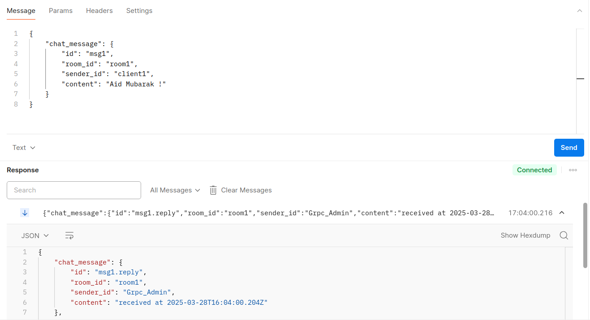
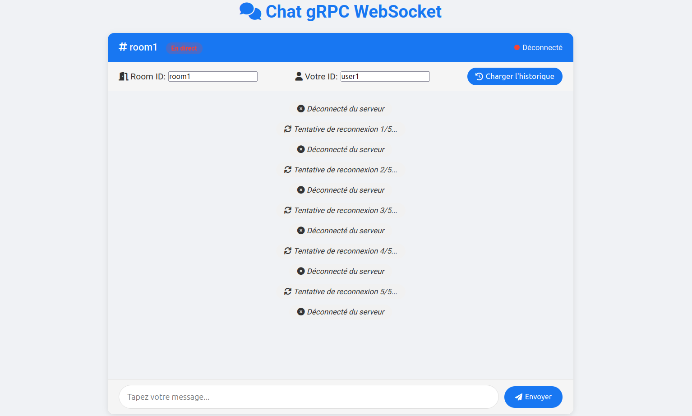
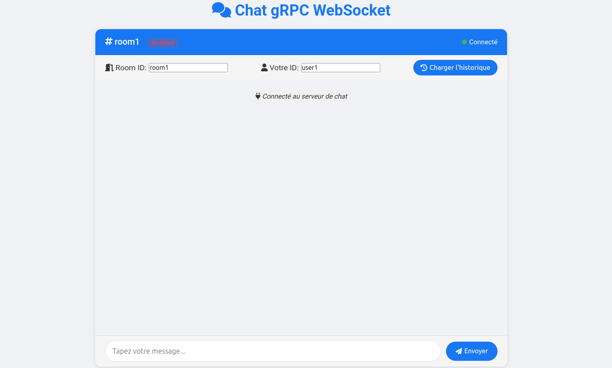
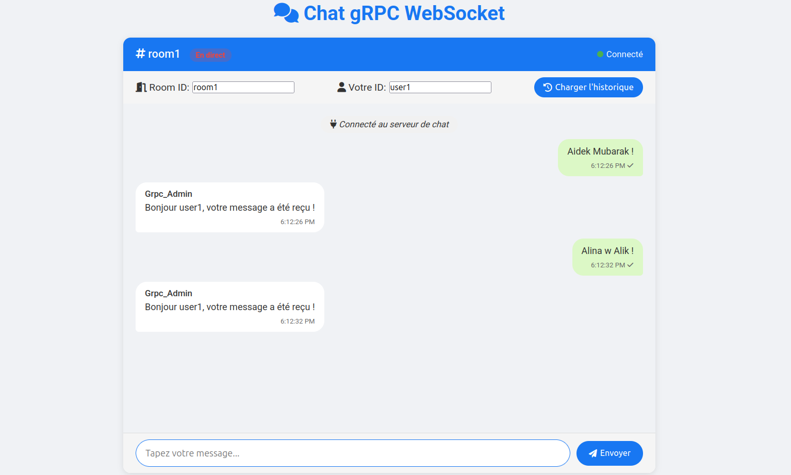
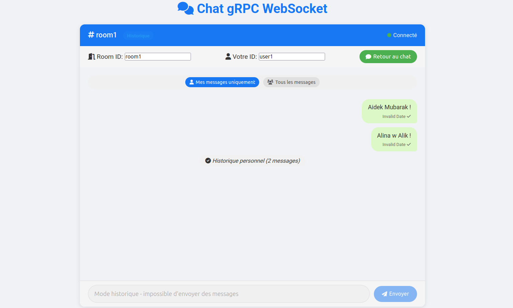

# TP5 - Reverse Proxy WebSocket avec microservice gRPC

Ce projet consiste à créer un système de chat en temps réel qui utilise gRPC pour la communication serveur-serveur et WebSocket pour la connexion client-serveur. L'architecture inclut un reverse proxy pour faciliter la communication entre le frontend et le backend gRPC.

## Objectifs

- Comprendre l'architecture des microservices.
- Implémenter un service gRPC qui gère les messages du chat.
- Créer un proxy WebSocket qui fait le pont entre les clients web et le service gRPC.
- Développer une interface utilisateur web pour le chat.
- Mettre en place un système de consultation d'historique des messages.

## Technologies utilisées

- **Node.js** : Environnement d'exécution JavaScript côté serveur.
- **gRPC** : Framework RPC pour les communications entre microservices.
- **WebSocket** : Protocole pour la communication en temps réel entre le client et le serveur.
- **Protocol Buffers** : Format de sérialisation des données.
- **HTML/CSS/JavaScript** : Technologies web pour l'interface utilisateur.
- **dotenv** : Gestion des variables d'environnement.

## Étapes du projet

### 1. Définition du contrat gRPC (chat.proto)

Nous avons commencé par définir le fichier `chat.proto` qui spécifie les services et les messages pour notre système de chat :

- Service `ChatService` avec les méthodes `GetUser`, `Chat` (streaming bidirectionnel) et `GetChatHistory`.
- Messages `ChatMessage`, `User`, et autres structures de données nécessaires.

### 2. Implémentation du serveur gRPC

Ensuite, nous avons développé le serveur gRPC (`server.js`) qui :

- Gère les connexions des clients via le proxy.
- Stocke et traite les messages de chat.
- Maintient un historique des conversations par salle.
- Répond aux requêtes d'historique des messages.

### 3. Création du proxy WebSocket

Pour permettre aux clients web de communiquer avec le serveur gRPC, nous avons mis en place un proxy (`proxy.js`) qui :

- Expose une interface WebSocket pour les clients web.
- Convertit les messages WebSocket en appels gRPC.
- Fournit un endpoint HTTP pour récupérer l'historique des messages.
- Gère les problèmes de CORS et de connectivité.

### 4. Développement de l'interface utilisateur

L'interface utilisateur (`client.html`) offre :

- Un système de chat en temps réel avec indicateur de statut de connexion.
- La possibilité de changer de salon et d'identifiant utilisateur.
- Une fonction de chargement de l'historique des messages.
- Une interface adaptative entre le mode chat actif et consultation de l'historique.

### 5. Configuration des services

Les services sont configurés via des variables d'environnement dans le fichier `.env`, incluant :

- Les hôtes et ports pour les services gRPC et WebSocket.
- Les informations sur l'administrateur du système.

## Tests et fonctionnalités

### Connexion au serveur WebSocket dans Postman



Dans cette image, on voit la connexion réussie au proxy WebSocket via Postman. L'URL de connexion est `ws://localhost:8080` et nous envoyons un message JSON conforme au schéma ChatStream.

### Détection de déconnexion serveur



L'interface utilisateur détecte quand le serveur est hors ligne et propose une reconnexion automatique, avec un indicateur visuel clair (point rouge).

### Connexion au chat



L'interface affiche une confirmation de connexion au serveur, avec un statut "En direct" clignotant en rouge et un point vert indiquant une connexion active.

### Échange de messages



On peut voir l'échange de messages entre l'utilisateur et le serveur, avec des bulles différenciées pour les messages envoyés et reçus, ainsi que des informations sur l'expéditeur et l'horodatage.

### Consultation de l'historique



L'interface permet de consulter l'historique des messages d'une salle spécifique, avec la possibilité de filtrer les messages par utilisateur ou de voir tous les messages.

## Structure du projet

- `chat.proto` : Définition des services et messages gRPC.
- `server.js` : Implémentation du serveur gRPC.
- `proxy.js` : Proxy WebSocket qui fait le lien entre WebSocket et gRPC.
- `client.html` : Interface utilisateur web pour le chat.
- `.env` : Fichier de configuration des variables d'environnement.
- `images/` : Captures d'écran des tests.

## Démarrage des services

Pour démarrer l'application, exécutez ces commandes dans des terminaux séparés :

```bash
# Terminal 1: Démarrer le serveur gRPC
node server.js

# Terminal 2: Démarrer le proxy WebSocket
node proxy.js

# Ouvrez le fichier client.html dans votre navigateur
```

## Conclusion

Ce projet démontre la mise en œuvre d'une architecture microservices pour une application de chat en temps réel. Il illustre l'utilisation de gRPC pour la communication entre services et de WebSocket pour la communication en temps réel avec le navigateur.


