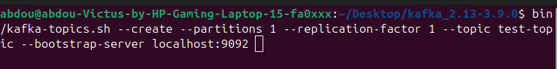

# TP6 - Système de Messagerie Apache Kafka avec MongoDB et API REST

Ce projet consiste à créer un système de messagerie distribué utilisant Apache Kafka pour la communication entre les services, MongoDB pour le stockage persistant des messages, et une API REST pour accéder aux données.

## Objectifs

- Comprendre l'architecture des systèmes de messagerie basés sur Kafka.
- Implémenter un producteur Kafka qui envoie des messages à un topic.
- Créer un consommateur Kafka qui traite et stocke les messages dans MongoDB.
- Développer une API REST pour accéder aux messages stockés.
- Mettre en pratique les concepts de microservices dans un environnement distribué.
- Créer une interface utilisateur web pour visualiser les messages en temps réel.

## Technologies utilisées

- **Apache Kafka** : Plateforme de streaming distribuée pour la messagerie.
- **Node.js** : Environnement d'exécution JavaScript côté serveur.
- **Express** : Framework web pour créer l'API REST.
- **MongoDB** : Base de données NoSQL pour stocker les messages.
- **Mongoose** : ODM (Object Document Mapper) pour MongoDB.
- **KafkaJS** : Client Kafka pour Node.js.
- **dotenv** : Gestion des variables d'environnement.
- **Bootstrap 5** : Framework CSS pour l'interface utilisateur.
- **HTML/CSS/JavaScript** : Technologies frontend pour l'interface web.

## Étapes du projet

### 1. Configuration de Kafka et Zookeeper

Nous avons commencé par configurer Kafka et Zookeeper comme infrastructure de base pour notre système de messagerie. Cette étape inclut :

- L'installation et le démarrage de Zookeeper.
- La mise en place et la configuration de Kafka.
- La création d'un topic Kafka pour notre application.





### 2. Développement du producteur Kafka

Ensuite, nous avons développé le producteur Kafka (`producer.js`) qui :

- Se connecte au broker Kafka configuré.
- Envoie des messages au topic défini toutes les secondes.
- Gère les erreurs de connexion et d'envoi.


### 3. Implémentation du consommateur Kafka

Nous avons créé un consommateur Kafka (`consumer.js`) qui :

- S'abonne au topic Kafka spécifié.
- Traite les messages entrants.
- Stocke chaque message dans la base de données MongoDB.
- Journalise les opérations et les erreurs.


### 4. Création du modèle de données et connexion à MongoDB

Le fichier `db.js` définit :

- Le schéma des messages pour MongoDB via Mongoose.
- La connexion à la base de données MongoDB.
- L'exportation du modèle Message pour utilisation dans les autres modules.


### 5. Développement de l'API REST

Nous avons développé un serveur Express (`server.js`) qui :

- Expose une API REST pour accéder aux messages stockés.
- Fournit un endpoint pour récupérer tous les messages triés par date.
- Gère les erreurs et les réponses HTTP.


### 6. Création de l'interface utilisateur

Pour améliorer l'expérience utilisateur, nous avons développé une interface web moderne qui permet de :

- Visualiser en temps réel les messages consommés et stockés dans MongoDB.
- Afficher des statistiques sur les messages (nombre total, heure du dernier message).
- Rafraîchir manuellement ou automatiquement les données toutes les 5 secondes.
- Présenter les informations avec une interface utilisateur intuitive et responsive.

L'interface est construite avec HTML, CSS et JavaScript, en utilisant Bootstrap 5 pour le design et les composants UI.


## Structure du projet

- **producer.js** : Implémentation du producteur Kafka.
- **consumer.js** : Implémentation du consommateur Kafka qui stocke les messages dans MongoDB.
- **db.js** : Configuration de la connexion MongoDB et définition du modèle de données.
- **server.js** : Serveur Express qui expose l'API REST et sert les fichiers statiques.
- **package.json** : Configuration du projet Node.js et dépendances.
- **.env** (non inclus, à créer) : Fichier de configuration des variables d'environnement.
- **images/** : Captures d'écran des tests et de l'exécution.
- **public/** : Fichiers de l'interface utilisateur web.
  - **index.html** : Structure de la page web.
  - **styles.css** : Styles pour l'interface utilisateur.
  - **app.js** : Logique frontend pour interagir avec l'API.

## Démarrage des services

Pour démarrer l'application, exécutez ces commandes dans des terminaux séparés :

```bash
# Terminal 1: Démarrer Zookeeper
bin/zookeeper-server-start.sh config/zookeeper.properties

# Terminal 2: Démarrer Kafka
bin/kafka-server-start.sh config/server.properties

# Terminal 3: Démarrer le producteur
node producer.js

# Terminal 4: Démarrer le consommateur
node consumer.js

# Terminal 5: Démarrer le serveur API et l'interface web
node server.js
```

Une fois le serveur démarré, accédez à l'interface web à l'adresse : http://localhost:3000

## Tests et fonctionnalités

### Production et Consommation de Messages

Le producteur envoie des messages au topic Kafka, et le consommateur les reçoit et les stocke dans MongoDB.

### Stockage dans MongoDB

Chaque message reçu est stocké dans MongoDB avec sa valeur et un timestamp.

### API REST

L'API fournit un endpoint `/api/messages` qui permet de récupérer tous les messages stockés, triés par date de réception.

### Interface utilisateur web

L'interface web offre une visualisation en temps réel des messages stockés dans MongoDB et des statistiques sur ces messages, le tout dans un design moderne et responsive.

## Conclusion

Ce projet démontre la mise en œuvre d'une architecture de microservices basée sur Apache Kafka pour la messagerie asynchrone entre les services. Il illustre comment Kafka peut être utilisé comme middleware de communication, avec MongoDB comme solution de stockage persistant, une API REST pour exposer les données, et une interface web pour visualiser les informations en temps réel.


