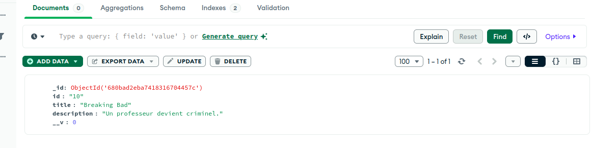

# TP7 - Microservices Films & Séries avec gRPC, Kafka, MongoDB, GraphQL et API REST

Ce projet met en œuvre une architecture microservices complète pour la gestion de films et séries TV, en utilisant gRPC pour la communication inter-services, Apache Kafka pour la messagerie asynchrone, MongoDB pour le stockage persistant, GraphQL et une API REST pour l'accès aux données. Une interface web simple permet de visualiser et d'ajouter des films et séries.

## Objectifs

- Comprendre l'architecture microservices avec gRPC, Kafka, MongoDB et GraphQL.
- Implémenter des microservices pour la gestion des films et séries TV.
- Utiliser Apache Kafka pour la communication asynchrone entre services.
- Persister les données dans MongoDB via Mongoose.
- Exposer une API REST et GraphQL pour accéder et manipuler les données.
- Créer une interface web pour illustrer le fonctionnement du système.

## Technologies utilisées

- **gRPC** : Communication rapide et typée entre microservices.
- **Apache Kafka** : Plateforme de streaming distribuée pour la messagerie.
- **Node.js** : Environnement d'exécution JavaScript côté serveur.
- **Express** : Framework web pour l'API REST et la passerelle API.
- **MongoDB** : Base de données NoSQL pour stocker les films et séries.
- **Mongoose** : ODM pour MongoDB.
- **KafkaJS** : Client Kafka pour Node.js.
- **GraphQL** : API flexible pour requêtes et mutations de données.
- **dotenv** : Gestion des variables d'environnement.
- **HTML/CSS/JavaScript** : Interface web simple (aucun framework frontend).

## Étapes du projet

### 1. Configuration de l'infrastructure (Kafka, Zookeeper, MongoDB)

- Installation et démarrage de Zookeeper et Kafka.
- Création des topics `movies_topic` et `tvshows_topic` pour la messagerie.
- Démarrage de MongoDB pour le stockage des données.


### 2. Développement des microservices gRPC

- `movieMicroservice.js` : microservice pour la gestion des films (CRUD via gRPC, persistance MongoDB).
- `tvShowMicroservice.js` : microservice pour la gestion des séries TV (CRUD via gRPC, persistance MongoDB).

#### Ajout et consultation de films


#### Ajout et consultation de séries TV


### 3. Mise en place de l'API Gateway (REST & GraphQL)

- `apiGateway.js` : passerelle API qui expose des endpoints REST et GraphQL pour interagir avec les microservices via gRPC.
- Intégration du middleware CORS et gestion des variables d'environnement avec dotenv.

#### Endpoints REST - Films


#### Endpoints REST - Séries TV


### 4. Intégration de Kafka (Producteur & Consommateur)

- Publication d'un message sur le topic approprié lors de la création d'un film ou d'une série TV.
- Consommation des messages Kafka et affichage dans la console.


### 5. Modélisation des données et connexion à MongoDB

- `models.js` : schémas Mongoose pour les entités Movie et TVShow.
- Connexion à MongoDB centralisée et sécurisée via .env.

#### Ajout et vérification de films dans MongoDB


#### Ajout et vérification de séries TV dans MongoDB




### 6. Interface web AbdouFlix

- `index.html` : page web simple pour visualiser et ajouter des films/séries via l'API REST.
- Affichage dynamique des listes et formulaires d'ajout.

#### Scénario d'utilisation de l'interface web

1. Accueil sur l'interface AbdouFlix
   
2. Ajout d'un film via le formulaire
   
3. Confirmation de l'ajout du film
   
4. Ajout d'une série TV via le formulaire
   
5. Confirmation de l'ajout de la série TV
   

### 7. Intégration de GraphQL

- L'API Gateway expose également un endpoint `/graphql` permettant d'interroger et de manipuler les films et séries TV via GraphQL.
- Les schémas et résolveurs sont définis dans `schema.js` et `resolvers.js`.
- Vous pouvez utiliser des outils comme Apollo Studio ou Postman pour tester les requêtes et mutations GraphQL.

#### Exemples d'opérations GraphQL


## Structure du projet

- **apiGateway.js** : Passerelle API REST/GraphQL, intégration Kafka, communication gRPC.
- **movieMicroservice.js** : Microservice gRPC pour les films.
- **tvShowMicroservice.js** : Microservice gRPC pour les séries TV.
- **models.js** : Schémas Mongoose pour MongoDB.
- **schema.js / resolvers.js** : Schéma et résolveurs GraphQL.
- **index.html** : Interface web AbdouFlix (HTML/CSS/JS natif).
- **package.json** : Dépendances et scripts Node.js.
- **.env** (à créer) : Variables d'environnement (MongoDB, ports, Kafka...)
- **images/** : Captures d'écran des tests et de l'exécution.

## Démarrage des services

Dans des terminaux séparés, exécutez :

```bash
# Terminal 1: Démarrer Zookeeper
bin/zookeeper-server-start.sh config/zookeeper.properties

# Terminal 2: Démarrer Kafka
bin/kafka-server-start.sh config/server.properties

# Terminal 3: Créer les topics
bin/kafka-topics.sh --create --topic movies_topic --bootstrap-server localhost:9092
bin/kafka-topics.sh --create --topic tvshows_topic --bootstrap-server localhost:9092

# Terminal 4: Démarrer MongoDB
mongod

# Terminal 5: Démarrer le microservice films
node movieMicroservice.js

# Terminal 6: Démarrer le microservice séries TV
node tvShowMicroservice.js

# Terminal 7: Démarrer l'API Gateway
node apiGateway.js
```

Pour l'interface web, servez le fichier `index.html` via un serveur web local (ex: http-server ou python3 -m http.server) :

```bash
cd /home/abdou/Desktop/SOA\ et\ Microservices/TP7
python3 -m http.server 8080
# puis ouvrez http://localhost:8080/index.html
```

## Tests et fonctionnalités

### Création et consultation de films/séries
- Ajoutez des films/séries via l'interface web ou Postman.
- Vérifiez la persistance dans MongoDB et la publication Kafka.
- Consultez les listes et détails via l'API REST ou l'interface web.

### Kafka
- Vérifiez la réception des messages dans la console de l'API Gateway.
- Utilisez les outils Kafka pour consommer les topics manuellement si besoin.

### MongoDB
- Vérifiez la présence des documents dans la base via Compass ou mongo shell.

### Interface web
- Ajoutez et visualisez dynamiquement les films et séries TV.
- Rafraîchissement automatique après ajout.

### GraphQL
- Testez les requêtes et mutations via l'endpoint `/graphql` avec Apollo Studio ou Postman.
- Exemples : ajout, récupération par ID, récupération de listes, etc.

## Conclusion

Ce projet illustre la mise en œuvre d'une architecture microservices moderne, combinant gRPC, Kafka, MongoDB, API REST/GraphQL et une interface web légère. Il met en avant la communication asynchrone, la persistance des données et l'intégration de plusieurs technologies pour un système distribué robuste et évolutif.
