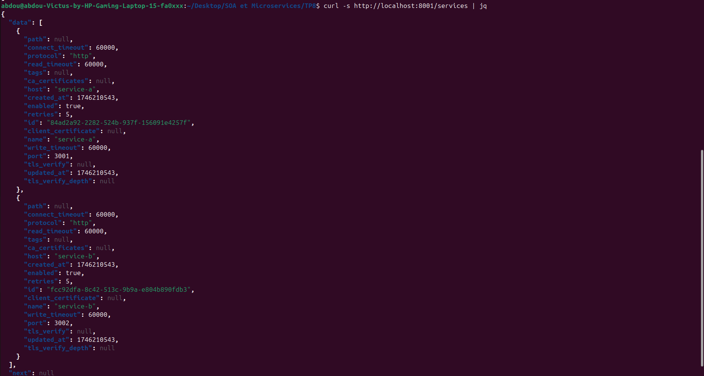

# TP8 - Microservices avec API Gateway Kong et Docker

Ce projet implémente une architecture microservices simple utilisant Kong comme API Gateway pour router les requêtes vers différents services. L'ensemble de l'infrastructure est conteneurisée avec Docker et Docker Compose pour faciliter le déploiement et la gestion des services.

## Objectifs

- Comprendre l'architecture microservices et le pattern API Gateway
- Implémenter et configurer Kong comme API Gateway
- Déployer des microservices Node.js simples
- Orchestrer l'ensemble avec Docker et Docker Compose
- Tester l'interaction entre les services via l'API Gateway

## Technologies utilisées

- **Kong** : API Gateway open-source performant
- **Node.js** : Environnement d'exécution JavaScript côté serveur
- **Express** : Framework web léger pour créer des API
- **Docker** : Plateforme de conteneurisation
- **Docker Compose** : Outil de définition et d'exécution d'applications Docker multi-conteneurs

## Architecture

Le projet est composé de trois services principaux :

1. **Kong** : API Gateway qui route les requêtes vers les services appropriés
2. **Service A (Users)** : Microservice exposant une API pour la gestion des utilisateurs
3. **Service B (Products)** : Microservice exposant une API pour la gestion des produits

### Routing avec Kong

Kong est configuré pour router les requêtes selon les chemins suivants :
- `/users` → Service A (Port 3001)
- `/products` → Service B (Port 3002)

## Étapes du projet

### 1. Configuration de Kong et des services

Le fichier `kong.yml` définit la configuration déclarative de Kong, spécifiant les services et les routes :

```yaml
_format_version: "1.1"
services:
- name: service-a
  url: http://service-a:3001
  routes:
  - name: users-route
    paths: ["/users"]
- name: service-b
  url: http://service-b:3002
  routes:
  - name: products-route
    paths: ["/products"]
```

### 2. Orchestration avec Docker Compose

Le fichier `docker-compose.yml` définit l'infrastructure complète, incluant Kong et les deux microservices, tous connectés via un réseau Docker dédié.

### 3. Vérification des services

Une fois l'infrastructure déployée, les services sont accessibles via Kong :


## Services implémentés

### Service A - Users API

Un service Node.js simple exposant une API REST pour la gestion des utilisateurs :

```javascript
const express = require('express');
const app = express();
const PORT = 3001;
const users = [ { id: 1, name: 'Alice' }, { id: 2, name: 'Bob' } ];

app.get('/', (req, res) => res.json(users));
app.listen(PORT, () => console.log(`Service A running on :${PORT}`));
```

### Service B - Products API

Un service Node.js simple exposant une API REST pour la gestion des produits :

```javascript
const express = require('express');
const app = express();
const PORT = 3002;
const products = [ 
  { id: 1, name: 'Laptop', price: 999.99 },
  { id: 2, name: 'Smartphone', price: 699.99 }
];

app.get('/', (req, res) => res.json(products));
app.listen(PORT, () => console.log(`Service B running on :${PORT}`));
```

## Tests et vérifications

### 1. Vérification des services configurés dans Kong

Interrogation de l'API d'administration de Kong pour vérifier les services configurés :



### 2. Test des APIs via Kong

Accès aux APIs à travers Kong pour vérifier le routage :


### 3. Test avec Postman

Vérification des APIs avec Postman :


## Structure du projet

```
.
├── docker-compose.yml      # Configuration Docker Compose
├── kong.yml               # Configuration déclarative de Kong
├── images/                # Captures d'écran des tests
│   ├── curlservice.png
│   ├── curlusersandproducts.png
│   ├── dockerps.png
│   ├── testpostmanproducts.png
│   ├── testpostmanservices.png
│   └── testpostmanusers.png
├── service-a/             # Microservice Users
│   ├── Dockerfile
│   ├── index.js
│   └── package.json
└── service-b/             # Microservice Products
    ├── Dockerfile
    ├── index.js
    └── package.json
```

## Démarrage des services

Pour démarrer l'ensemble des services :

```bash
docker-compose up -d
```

Pour vérifier l'état des services :

```bash
docker-compose ps
```

Pour accéder à l'API d'administration de Kong :

```bash
curl http://localhost:8001/services
```

Pour tester les APIs via Kong :

```bash
# API Users
curl http://localhost:8000/users

# API Products
curl http://localhost:8000/products
```

## Résolution des problèmes courants

Si vous rencontrez des problèmes de connexion avec l'API d'administration de Kong (port 8001), assurez-vous que :

1. La configuration KONG_ADMIN_LISTEN dans docker-compose.yml est correctement définie à "0.0.0.0:8001"
2. Les ports sont correctement exposés dans docker-compose.yml (8000 et 8001)

## Conclusion

Ce projet démontre la mise en œuvre d'une architecture microservices simple avec Kong comme API Gateway. L'utilisation de Docker et Docker Compose permet de déployer facilement l'ensemble de l'infrastructure et facilite la gestion des services.

Les avantages de cette architecture incluent :
- Séparation claire des responsabilités entre services
- Routage centralisé via un API Gateway
- Facilité de déploiement et de scaling grâce à Docker
- Interface d'administration Kong pour la gestion des services et des routes